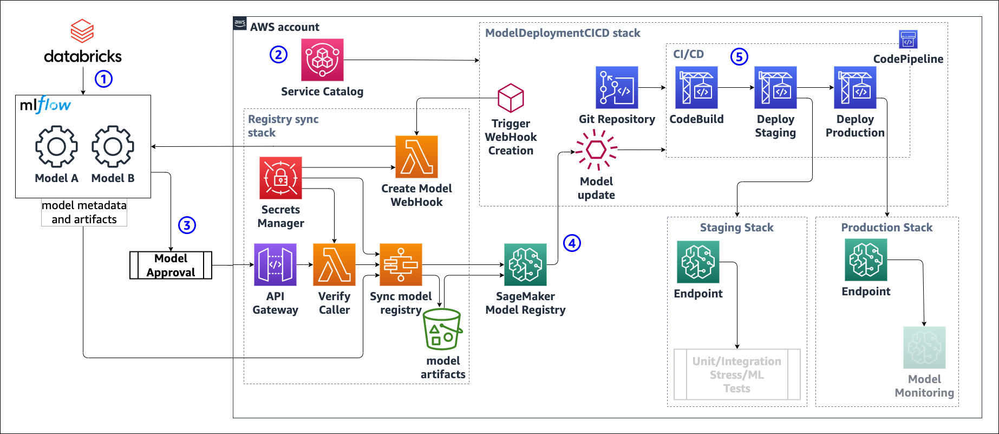

# Automating the deployment of MLflow models with Amazon SageMaker

This repository demonstrates how to automate and scale the deployment of models from [MLflow model registry](https://mlflow.org/docs/latest/model-registry.html) to an [Amazon SageMaker Endpoint](https://docs.aws.amazon.com/sagemaker/latest/dg/deploy-model.html).

The code is provided as an example, and it isn't intended to use in a production environment without a review of all configurations and code to comply with any security requirements.

The deployment of this sample will create resources outside of AWS free tier, please review the [Running Costs](#3-running-costs) section of this document.

- [1. Objective](#1-objective)
- [2. Operation](#2-operation)
  - [2.1. Prerequisites](#21-prerequisites)
  - [2.2. Create the Service Catalog product and the Registry Sync Application](#22-create-the-service-catalog-product-and-the-registry-sync-application)
    - [2.2.1. Assign a IAM user or role to the Service Catalog product](#221-assign-a-iam-user-or-role-to-the-service-catalog-product)
  - [2.3. Deploy a model](#23-deploy-a-model)
    - [2.3.1. Provision the CI/CD pipeline](#231-provision-the-cicd-pipeline)
    - [2.3.2. Promote a model to production](#232-promote-a-model-to-production)
- [3. Running Costs](#3-running-costs)
- [4. Clean up](#4-clean-up)
  - [4.1. Remove a Model Deployment CI/CD pipeline](#41-remove-a-model-deployment-cicd-pipeline)
  - [4.2. Remove the project completely](#42-remove-the-project-completely)
  
## 1. Objective

Deploying models registered with MLflow Model registry to Amazon SageMaker real-time endpoints in a programmatic, repeatable, and automatic fashion.



1. Register a version of the model in mlflow model registry.
2. Create the CI/CD pipeline to deploy an MLflow model using the product in Service Catalog, providing the model name.
3. In MLflow, set the stage of the model to either `Staging` or `Production`
4. A [webhook](https://docs.databricks.com/applications/mlflow/model-registry-webhooks.html) triggers a step function to sync MLflow registry with Amazon SageMaker Model Registry. The step function
   1. repackages the model artifact into a format suitable for SageMaker deployments
   2. stores the new artifact in an S3 bucket
   3. create the model package for registering, including a reference to the docker image to be used for deployment (currently only tensorflow implemented)
   4. Any change in the Model Package Group associated with the mlflow model triggers a run of the CI/CD pipeline using EventBridge
   5. The CI/CD deploys staging and production endpoints according to the metadata of all the model version registered in the Model Registry.

## 2. Operation

The project uses [CDK pipelines](https://docs.aws.amazon.com/cdk/v2/guide/cdk_pipeline.html) to create the deployment pipeline, offering the flexibility to reshape the deployment to integrate with a variety of processes and governance requirements.

### 2.1. Prerequisites

- Store the credentials for programmatic access to mlflow model registry, either as a User name/password or as application token, into AWS Secrets Manager in the same region where the stack is to be deployed
   - For example
```
   { 
      "DATABRICKS_HOST" : "https://<instance-name>.cloud.databricks.com", 
      "DATABRICKS_TOKEN” : "<password-or-token>”
   }
```
- Create a CodeCommit repository in the same region where the stack is to be deployed
- An [Amazon SageMaker Studio domain](https://docs.aws.amazon.com/sagemaker/latest/dg/gs-studio-onboard.html) in the same region where the stack is to be deployed. Studio offers a convenient environment visualize model in SageMaker model registry and the associated endpoints.
   - Note: Technically an active domain is not necessary as long as one has been created previously. The project uses roles that are created with your first domain

### 2.2. Create the Service Catalog product and the Registry Sync Application

Clone the repository into a local directory, and setup a new `remote` pointing at the CodeCommit repository.
Deploy the project with

```terminal
cdk deploy \
    --parameters SecretName=<name of the secret> \
    --parameters RepositoryName=<name of the repository> 
```

Common issues:

- the account/region needs to bootstrap CDK. See [CDK- Bootstrapping](https://docs.aws.amazon.com/cdk/v2/guide/bootstrapping.html)
- need to specify the profile and/or the environment for CDK to have sufficient permissions and to deploy into the correct account/region. See [CDK - Permissions](https://docs.aws.amazon.com/cdk/v2/guide/permissions.html)

Once the CDK deployment is completed (you can verify also in the CloudFormation console), you should find a CodePipeline called `MLflow-MLOps` in progress. This is a self-mutating pipeline, it is expected it might run multiple times and change its configuration.  
A successful execution of the pipeline results in two CloudFormation stacks: `ModelRepack-ModelSyncStack` and `ServiceCatalogProduct-ScProductStack`. `ModelRepack-ModelSyncStack` contains

- StepFunction with corresponding Lambda functions
- Api Gateway with REST endpoint to receive webhook invocations
- S3 bucket `sagemaker-mlflow-<region>-<account>` to store model artifacts
- a Secret in Secret manager, used to authenticate the webhook invocations.

#### 2.2.1. Assign a IAM user or role to the Service Catalog product

The deployment creates a new portfolio in Service Catalog called `MLflow-MLOps`. To create a model deployment pipeline, grant the the relevant End User access to the portfolio following the [documentation](https://docs.aws.amazon.com/servicecatalog/latest/adminguide/getstarted-deploy.html).

### 2.3. Deploy a model

#### 2.3.1. Provision the CI/CD pipeline

Authorized IAM users/roles can provision the `Deploy-MLflow-model` from service catalog. The provisioning requires as input parameter, `model_name`. This **must** match the model name in MLflow model registry for the automatic model synchronization to work.  
The product provisions

- a CodeCommit repository called `sagemaker-mlflow-<model_name>-deployment`
- a self-mutating CDK pipeline in CodePipeline, called `sagemaker-mlflow-<model_name>-pipeline`
- an S3 bucket necessary to support the CDK pipeline. The name of the bucket is generated automatically
- a webhook in mlflow model registry configured to monitor status changes in the model named `<model_name>`
- an EventBridge Rule monitoring SageMaker Model Registry for any changes in ModelGroups with name `<model_name>`

The CDK pipeline will execute and, if it doesn't encounter any error, it will create two CloudFormation Stacks: `ProductionStack-ModelDeploy` and `StagingStack-ModelDeploy`. Both stacks should be empty.

#### 2.3.2. Promote a model to production

After [registering a model](https://docs.databricks.com/applications/machine-learning/manage-model-lifecycle/index.html#create-or-register-a-model) in MLflow model registry, [transition](https://docs.databricks.com/applications/machine-learning/manage-model-lifecycle/index.html#transition-a-model-stage) the model version of interest to either `Staging` or `Production`.  
Here's the sequence of events:

1. the stage transition triggers the webhook
2. the webhook triggers the execution of the the step function
3. Step function
   1. the step function compares the state of the model version in mlflow model registry with the corresponding model package in SageMaker Model Registry. The matching is based on the model `run_id`.
   2. If necessary the step function repackages the model artifact into a `tar.gz` file compatible with deployment using SageMaker Frameworks images. The model packages are stored in the dedicated S3 bucket `sagemaker-mlflow-<region>-<account>`
   3. Register new models packages, updates the model metadata, or delete model packages in SageMaker Model Registry
4. The EventBridge rule detects changes in the SageMaker Model Registry Model Group and triggers the execution of the model deployment CI/CD pipeline
5. The CI/CD pipeline deploys the models to SageMaker endpoints using the Model Packages in SageMaker Model Registry and the configuration in `inference.yaml`
6. Once the CI/CD pipeline execution is completed, the Staging and Production stacks should contain the corresponding endpoints. The endpoint(s) name(s) from the output panel of the CloudFormation stacks.

The template does not include any test for the endpoint or model monitoring. These can be added by modifying the relevant code in the CodeCommit repository.

## 3. Running Costs

As of September 2022, a sample breakdown of the estimated  running cost of the solution is as follows, before considering [AWS Free Tier](https://aws.amazon.com/free/).

- **Amazon API Gateway** - the sample deploys 1 REST endpoint to receive the change of state from the selected models in mlflow model registry. Assuming few hundreds model transitions per month, the cost will be much less than $0.10. [Amazon API Gateway Pricing](https://aws.amazon.com/api-gateway/pricing/)
- **AWS Step Functions** - every change of state of a selected model in mlflow model registry triggers the execution of a Step Function. Assuming 1000 executions per month, the cost will be much less than $`0.10` . [AWS Step Functions Pricing](https://aws.amazon.com/step-functions/pricing/)
- **AWS Lambda Functions** - there are two classes of Lambda functions in the sample:
  - functions used supporting the creation of custom resources as part of the CloudFormation deployments. These are executed rarely, and the accrued cost is negligible.
  - functions used in the model registry synchronization as part of the Step Function.  
  
  Assuming 1000 executions per month, the cost will be much less than $`0.10` . [AWS Lambda Pricing](https://aws.amazon.com/lambda/pricing/)
- **AWS Secrets Manager** - the solution requires a secret per model group, plus one secret for holding the credentials to access mlflow. Assuming 5 models groups in operation, and 1000 API calls to access the relevant secrets, monthly cost is around $`2.40` . [AWS Secrets Manager Pricing](https://aws.amazon.com/secrets-manager/pricing/)
- **AWS CodePipeline** - the solution deploys one Pipeline for the CICD of the solution itself, and one Pipeline for each model group that is operationalized. Assuming 5 models groups in operation, the expected monthly cost is $5. [AWS CodePipeline pricing](https://aws.amazon.com/codepipeline/pricing/)
- **AWS CodeBuild** - all the Code Pipelines run CodeBuild jobs with the default `general1.small` instances. Assuming 100 CICD executions per month, the expected cost is less than $4. [AWS CodeBuild pricing](https://aws.amazon.com/codebuild/pricing)
- **Amazon SageMaker**
  - Amazon SageMaker Model Registry - free of charge, but there are costs associated with Storage in Amazon S3 for the model artifact, and Amazon ECR for any custom Docker image
  - Amazon SageMaker hosting - the cost and the units of billing depends on the choice of endpoint configuration. The default values used in the sample are
    - Staging models versions: 1 x `ml.m5.large` instance, $0.144/h in Singapore region
    - Production model versions: Serverless Inference with 1024 MB of memory. Assuming a processing time per request of 150 ms, the cost for 10,000 requests is around $0.03 in Singapore Region.
  
  [Amazon SageMaker Pricing](https://aws.amazon.com/sagemaker/pricing)

## 4. Clean up

To avoid incurring into unnecessary costs, it is recommended to delete the endpoints when not in use.
This can be achieved by deleting the Cloudformation Stacks  `ProductionStack-ModelDeploy` and `StagingStack-ModelDeploy`. A more elegant alternative is to change the state of the model(s) in MLflow Model registry to `None` or `Archived`. This in turn will remove the models from SM Model Registry and trigger the CodePipeline, resulting in the deletion of the endpoints.

### 4.1. Remove a Model Deployment CI/CD pipeline

[Terminate](https://docs.aws.amazon.com/servicecatalog/latest/adminguide/provisioned-products.html) the corresponding provisioned product using ServiceCatalog. This should send a delete request to the corresponding CloudFormation template. Even after deletion of the CloudFormation template, the pipeline artifact S3 bucket will persist, and it will need to be deleted manually.

### 4.2. Remove the project completely

Delete the `ModelRepack-ModelSyncStack` and `ServiceCatalogProduct-ScProductStack` CloudFormation Stacks.

1. Delete `MlflowMlopsStack` CloudFormation stack
2. Delete the secret in AWS SecretManager and the CodeCommit repository
3. Empty the model artifact bucket. If there are still model registered in SageMaker Model Registry originally synchronized from mlflow model registry, removing the model artifacts will make it impossible to deploy these models.
